  
  
  
  

  I build practical software, responsive websites, automation tools, and
  dependable technical solutions.

  I currently work in IT while pursuing a B.S. in Software Development at
  Grand Canyon University. I am especially interested in application
  development, algorithms, systems administration, and self-hosted
  infrastructure.

  I aim to approach technology with integrity, thoughtful stewardship,
  and a focus on serving real people through useful solutions.

---

## Developer Dashboard

  

---

## Technologies and Tools

  
  
  
  
  
  

  
  
  
  
  
  

  
  
  
  
  

---

## Featured Work

<table>
  <tr>
    <td width="50%" valign="top">
      <h3><a href="https://github.com/IPFizzy/umoja-pamoja-website">Umoja Pamoja Youth Outreach</a></h3>
      

        Responsive React and TypeScript website concept for a Christian youth
        outreach in Tanzania, built with Vite and deployed through GitHub Pages.
      

      

        <a href="https://github.com/IPFizzy/umoja-pamoja-website"><strong>Repository</strong></a>
        &nbsp;·&nbsp;
        <a href="https://ipfizzy.github.io/umoja-pamoja-website/"><strong>Live Demo</strong></a>
      

    </td>
    <td width="50%" valign="top">
      <h3><a href="https://github.com/IPFizzy/FantasyStorefront">Fantasy Storefront</a></h3>
      

        Java storefront with JSON-backed inventory, shopping-cart services,
        sorting, a loopback-only administration client, Maven, and JUnit tests.
      

      

        <a href="https://github.com/IPFizzy/FantasyStorefront"><strong>Repository</strong></a>
      

    </td>
  </tr>
</table>

---

## Projects and Repositories

A categorized directory of my finished public work, including larger applications and focused practice projects.

### Applications, Games, and Desktop Software

| Repository | Focus |
| --- | --- |
| [FantasyStorefront](https://github.com/IPFizzy/FantasyStorefront) | Java storefront with inventory, cart logic, JSON persistence, local administration service, Maven, and JUnit testing |
| [Minesweeper](https://github.com/IPFizzy/Minesweeper) | C# Windows Forms Minesweeper game with configurable difficulty, themes, scoring, persistent high scores, and xUnit-tested game logic |
| [VehicleStore](https://github.com/IPFizzy/VehicleStore) | C# vehicle inventory and storefront demonstrating inheritance, desktop and console clients, persistence, checkout, and tests |
| [ScriptureVerseManager](https://github.com/IPFizzy/ScriptureVerseManager) | C# Windows Forms Scripture library with validation, search, ranking, LINQ, and multi-format import/export |
| [PizzaMaker](https://github.com/IPFizzy/PizzaMaker) | C# Windows Forms pizza-ordering application with dynamic pricing, multi-pizza orders, layered design, and text-file export |
| [WhackAMole](https://github.com/IPFizzy/WhackAMole) | C# Windows Forms reaction game with progressive difficulty, decoys, lives, and persistent high scores |
| [ChessMoveVisualizer](https://github.com/IPFizzy/ChessMoveVisualizer) | C# GUI and console visualizer for legal movement patterns of five chess pieces on an empty board |

### Algorithms and Focused Utilities

| Repository | Focus |
| --- | --- |
| [FloodFillVisualizer](https://github.com/IPFizzy/FloodFillVisualizer) | Animated recursive flood fill across a randomized obstacle grid |
| [RecursiveNumberReducer](https://github.com/IPFizzy/RecursiveNumberReducer) | Recursive number-reduction exercise with safe termination, branching rules, validation, and call tracing |
| [FactorialCalculator](https://github.com/IPFizzy/FactorialCalculator) | Iterative and recursive factorial implementations with BigInteger and result verification |
| [GCDCalculator](https://github.com/IPFizzy/GCDCalculator) | Recursive and iterative Euclidean GCD implementations with step counting and multi-value support |
| [NameCharacterAnalyzer](https://github.com/IPFizzy/NameCharacterAnalyzer) | Small C# console utility for character-value analysis and input handling |

### Web and Community

| Repository | Focus |
| --- | --- |
| [umoja-pamoja-website](https://github.com/IPFizzy/umoja-pamoja-website) | Responsive React and TypeScript outreach website concept with a live GitHub Pages deployment |

  <a href="https://github.com/IPFizzy?tab=repositories"><strong>Browse all public repositories →</strong></a>

---

## GitHub Activity

  
  

  

## GitHub Trophies

  

---

## Current Focus

- Studying algorithms and data structures
- Building maintainable C# and Python applications
- Creating responsive React and TypeScript interfaces
- Expanding my Java application-development experience
- Growing my systems administration, automation, and self-hosting skills

---

  

